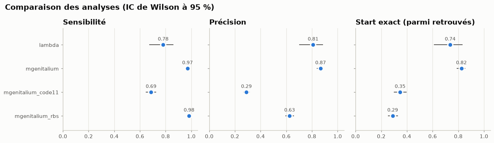
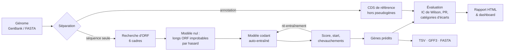
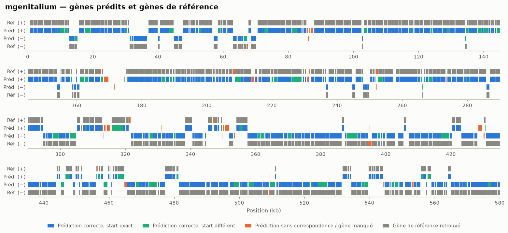
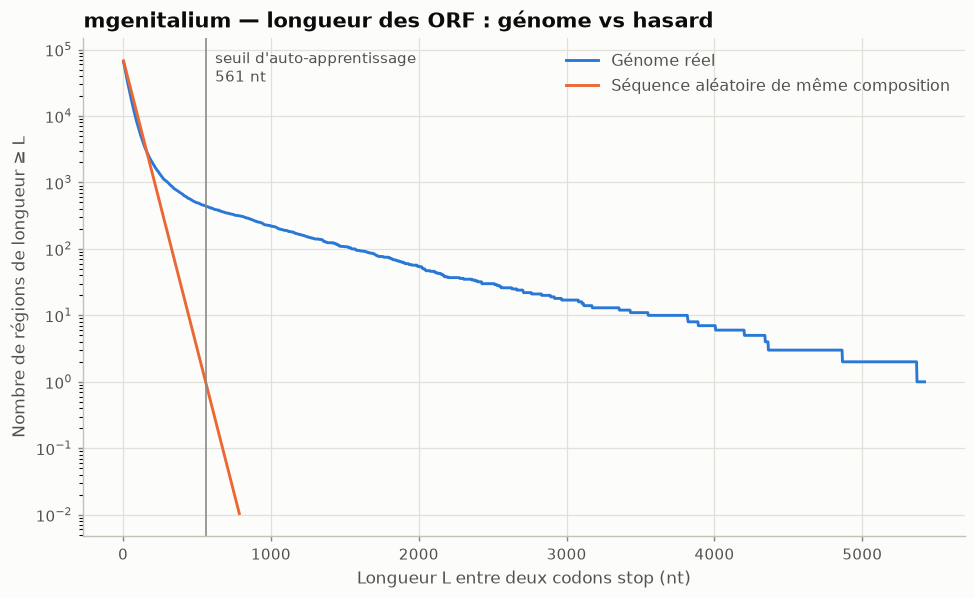
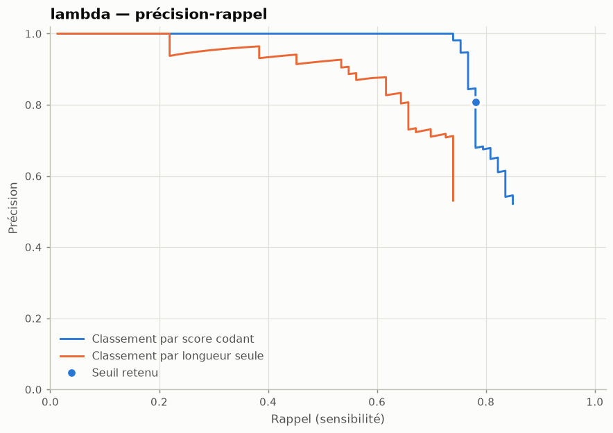
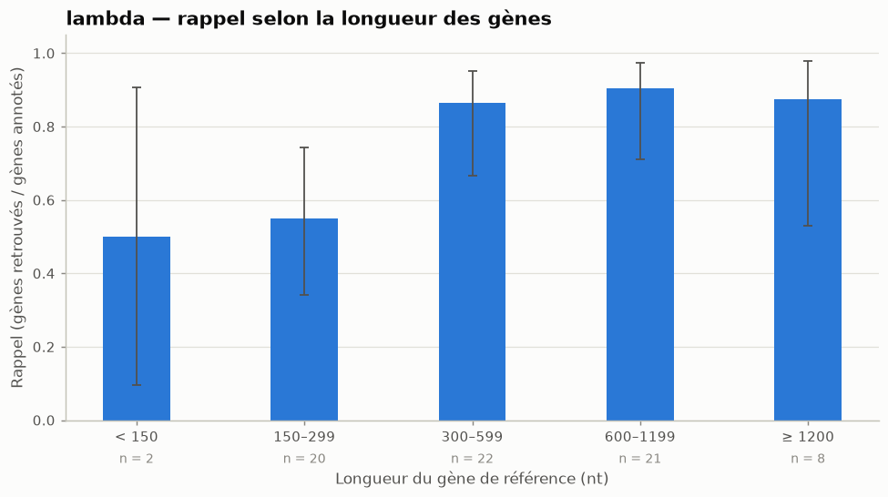
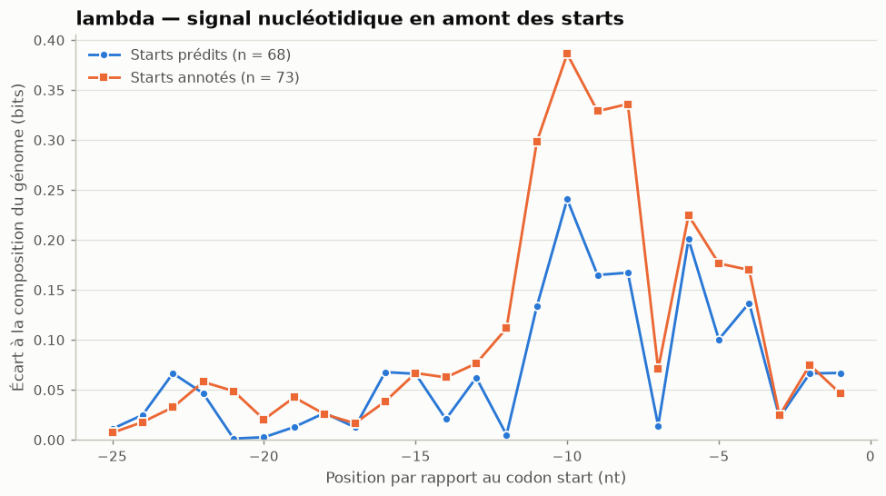
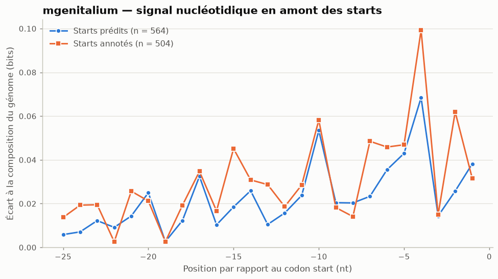
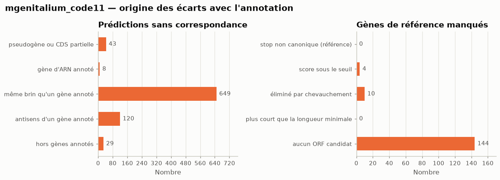
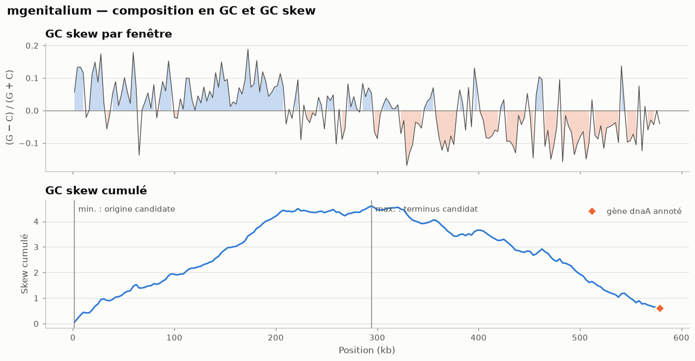

# orfeval

**Trouver les gènes d'un génome bactérien à partir de sa seule séquence, et mesurer honnêtement la qualité du résultat.**

[](https://github.com/narvall018/orfeval/actions/workflows/ci.yml)


[](https://github.com/astral-sh/ruff)

[](LICENSE)

*English summary [at the end of this page](#english-summary).*

---

## En bref

| | |
|---|---|
| **Ce que fait le projet** | orfeval prédit les gènes codants d'un génome procaryote (bactérie, phage) **sans rien savoir de son annotation** : il apprend la « signature » des gènes sur le génome lui-même. Il compare ensuite ses prédictions à l'annotation GenBank de référence, avec des statistiques et une analyse des erreurs. |
| **Pourquoi** | La prédiction de gènes est la première étape de toute annotation de génome. Évaluer correctement un prédicteur (quel critère d'appariement, quelle incertitude, que valent les « erreurs ») est aussi important que le prédicteur lui-même, et c'est souvent négligé. |
| **Le tester** | `make install && source .venv/bin/activate && orfeval demo`, soit environ 15 secondes sur deux génomes publics fournis. |
| **Ce qu'on obtient** | Gènes prédits (TSV, GFF3, protéines FASTA), un rapport HTML autonome, 9 figures par génome et un dashboard interactif. |



*Résultats réels de `orfeval demo`. Sur* M. genitalium *, 97 % des gènes annotés sont
retrouvés (IC 95 % : 95,1–98,2 %). Analysé volontairement avec le mauvais code génétique, le
même génome voit sa précision chuter de 0,87 à 0,29 : c'est l'expérience de contrôle.*

---

## Sommaire

[Contexte](#contexte-bioinformatique) · [Objectifs](#objectifs) · [Fonctionnalités](#fonctionnalités) · [Démarrage rapide](#démarrage-rapide) · [Utilisation](#exemples-dutilisation) · [Fonctionnement](#fonctionnement) · [Données](#données-de-démonstration) · [Résultats](#résultats) · [Visualisations](#visualisations) · [Dashboard](#dashboard) · [Structure](#structure-du-dépôt) · [Technologies](#technologies) · [Tests](#tests-et-qualité) · [Reproductibilité](#reproductibilité) · [Limites](#limites) · [Roadmap](#roadmap) · [Compétences](#compétences-démontrées) · [Contribuer](#contribuer) · [Licence](#licence-et-citation)

## Contexte bioinformatique

Un génome bactérien est dense : environ 85 à 90 % de sa séquence code des protéines. Chaque gène
codant commence par un **codon start** (ATG, GTG, TTG) et se termine par un **codon stop**. Il
est lu dans l'un des six **cadres de lecture** (trois par brin). Trouver les gènes revient donc
à décider quels **cadres ouverts de lecture** (ORF) sont de vrais gènes, et où ils commencent.

Deux difficultés rendent le problème intéressant :

- **Le hasard crée des ORF.** Dans une séquence aléatoire, on trouve un codon stop environ
  tous les 20 codons. Les ORF courts sont donc très nombreux, et la plupart ne codent rien.
- **Le « code » dépend de l'organisme.** Les mycoplasmes, par exemple, lisent TGA comme un
  tryptophane et non comme un stop (code génétique 4). Utiliser le mauvais code fragmente
  les gènes.

Les outils de référence (Prodigal, GeneMarkS, Glimmer) apprennent sur le génome lui-même les
statistiques qui distinguent le codant du non-codant. orfeval reprend ce principe en version
simplifiée et transparente, et met l'accent sur **l'évaluation**.

## Objectifs

1. Implémenter un prédicteur **auto-entraîné**, qui n'accède jamais à l'annotation.
2. Fonder chaque choix sur une statistique explicite : modèle nul de la longueur des ORF,
   log-rapport de vraisemblance, intervalles de confiance.
3. Évaluer rigoureusement : critère standard (codon stop partagé), start évalué à part,
   comparaison à une référence naïve, catégorisation des erreurs.
4. Distinguer toujours le **technique**, le **statistique** et le **biologique**.
5. Livrer un logiciel propre, testé, documenté et reproductible.

## Fonctionnalités

- **Lecture** GenBank/FASTA (gzip accepté) avec validation : alphabet, taille, séquences
  multiples, enregistrements sans séquence.
- **Téléchargement NCBI** (`Bio.Entrez`) avec gzip déterministe et somme SHA-256.
- **Recherche d'ORF vectorisée** (numpy) sur les six cadres, pour tout **code génétique NCBI**,
  avec gestion des **génomes circulaires** (gènes à cheval sur l'origine).
- **Modèle nul géométrique** : choix, sans annotation, des ORF d'auto-apprentissage.
- **Modèle codant** (codons ou dicodons) en bits, face à un modèle de fond conditionné à
  l'absence de stop.
- **Choix du codon start** : ORF le plus long, motif de Shine-Dalgarno, ou score combiné.
- **Sélection des gènes** avec résolution des chevauchements (décalage du start).
- **Évaluation** :
  - sensibilité, précision, F1 et exactitude du start, avec IC de Wilson à 95 % ;
  - courbes précision-rappel face à la longueur seule, niveau nucléotidique ;
  - **origine de chaque écart** (pseudogène, antisens, chevauchement…).
- **Descripteurs du génome** : GC skew et repères de réplication, usage des codons (RSCU),
  signal en amont des starts (`Bio.motifs`).
- **Sorties** : TSV, GFF3 (lisible par IGV ou Artemis), protéines FASTA, JSON, figures, et un
  **rapport HTML autonome** (données, paramètres, méthodes, résultats, limites, versions).
- **Interfaces** : CLI (`fetch`, `validate`, `predict`, `analyze`, `report`, `demo`),
  **dashboard Streamlit**, et une API Python.

## Démarrage rapide

```bash
git clone https://github.com/narvall018/orfeval.git
cd orfeval
make install               # Python ≥ 3.11 ; crée .venv et installe tout
source .venv/bin/activate
orfeval demo               # 4 analyses, environ 15 s
```

Ouvrez ensuite `results/demo/report.html`, ou lancez le dashboard avec `make run`.
Sans `make` : `pip install -e ".[app,dev]"`. Avec Docker :
`docker build -t orfeval . && docker run --rm orfeval`.
Détails : [docs/installation.md](docs/installation.md) · [docs/quickstart.md](docs/quickstart.md).

## Exemples d'utilisation

```bash
orfeval validate data/demo/NC_000908.2.gb.gz           # contenu, code génétique, CDS exclues
orfeval fetch NC_000913.3 --outdir data/raw            # E. coli K-12 depuis le NCBI
orfeval predict data/raw/NC_000913.3.gb.gz -o results/ecoli --start-strategy rbs
orfeval analyze config/sensitivity.yaml                # plusieurs analyses décrites en YAML
orfeval report results/demo                            # régénère le rapport sans recalcul
```

```text
$ orfeval predict data/raw/NC_000913.3.gb.gz -o results/ecoli
✓ 4850 gènes prédits (code génétique 11, annotation (/transl_table)) → results/ecoli
  sensibilité : 0.914 [0.906–0.922] (3932/4300)
  précision   : 0.809 [0.798–0.820] (3923/4850)
  start exact : 0.649 [0.634–0.664] (2551/3932)
```

Référence complète de la CLI, de la configuration et des formats : [docs/usage.md](docs/usage.md).

## Fonctionnement



1. Les **ORF** sont recherchés sur les six cadres avec le code génétique de l'organisme,
   lu dans l'annotation.
2. Un **modèle nul** donne la longueur au-delà de laquelle moins d'un ORF est attendu par
   hasard : les ORF plus longs servent à l'entraînement, **sans consulter l'annotation**.
3. Un **modèle codant** (usage des codons) attribue à chaque candidat un score en bits.
4. Une **sélection gloutonne** retient les meilleurs candidats compatibles, puis le modèle est
   ré-entraîné sur les gènes prédits.
5. L'**évaluation** compare au GenBank (même brin et même codon stop) et explique chaque
   écart.

L'architecture logicielle (couches, flux de données, points d'extension) est détaillée dans
[docs/architecture.md](docs/architecture.md), et les justifications scientifiques, formules et
références dans [docs/methodology.md](docs/methodology.md).

## Données de démonstration

Deux génomes publics du NCBI RefSeq sont versionnés dans `data/demo/` : 450 Ko compressés,
avec leurs sommes SHA-256.

| Génome | Accession | Taille | Particularité |
|---|---|---|---|
| Phage lambda | NC_001416.1 | 48,5 kb, linéaire | génome très dense, gènes chevauchants |
| *Mycoplasmoides* (*Mycoplasma*) *genitalium* G37 | NC_000908.2 | 580 kb, circulaire | génome bactérien minimal, riche en AT, **code génétique 4** |

Provenance, conditions d'utilisation et ajout de vos propres génomes :
[docs/data.md](docs/data.md).

## Résultats

Voici les résultats de `orfeval demo`. Ils sont déterministes et reproductibles.

| Analyse | Gènes prédits | Sensibilité [IC 95 %] | Précision [IC 95 %] | Start exact |
|---|---|---|---|---|
| lambda (code 11) | 68 | 0,781 [0,673–0,860] | 0,809 [0,700–0,885] | 0,737 |
| *M. genitalium* (code 4) | 564 | 0,970 [0,951–0,982] | 0,867 [0,837–0,893] | 0,824 |
| *M. genitalium*, **code 11 forcé** (contrôle) | 1 195 | 0,687 [0,645–0,725] | 0,290 [0,265–0,316] | 0,347 |
| *M. genitalium*, start guidé par le RBS | 791 | 0,982 [0,966–0,991] | 0,626 [0,592–0,659] | 0,289 |
| *E. coli* K-12, **hors démo, aucun paramètre choisi dessus** | 4 850 | 0,914 [0,906–0,922] | 0,809 [0,798–0,820] | 0,649 |

**Lecture à trois niveaux :**

- **Technique.** La prédiction et l'évaluation de 580 kb prennent moins d'une seconde, et
  4,6 Mb sont traités en environ 15 s, figures comprises.
- **Statistique.**
  - Le modèle codant fait mieux que la longueur seule sur tous les génomes. Sur lambda, l'aire
    sous la courbe précision-rappel passe de 0,68 à 0,82.
  - Les gènes courts restent difficiles : sur lambda, le rappel est de 0,55 entre 150 et
    299 nt.
  - La règle de chevauchement est la première cause de gènes manqués.
- **Biologique (prudent).**
  - L'expérience de contrôle illustre la réassignation de TGA en tryptophane chez les
    mycoplasmes.
  - Chez *M. genitalium*, 22 des 75 prédictions « fausses » recouvrent des pseudogènes exclus
    de la référence : elles ne sont pas absurdes.
  - Le signal de Shine-Dalgarno est fort chez *E. coli* et chez lambda, faible chez
    *M. genitalium*. Cela explique pourquoi la meilleure stratégie de choix du start dépend
    du génome.

Analyse détaillée, limites de l'interprétation et commandes de reproduction :
**[docs/results.md](docs/results.md)**.

## Visualisations

Chaque figure répond à une question précise. Les légendes détaillées se trouvent dans le
rapport HTML.

| | |
|---|---|
|  **Où sont les erreurs ?** Gènes prédits face aux gènes annotés, le long des 580 kb de *M. genitalium*. |  **Les gènes laissent-ils une trace statistique ?** Les ORF longs sont bien plus nombreux que ce qu'attend le hasard (échelle log). |
|  **Le modèle apporte-t-il plus que la longueur ?** Courbes précision-rappel sur lambda. |  **Quels gènes sont manqués ?** Rappel par classe de longueur, avec IC de Wilson. |
|  **Y a-t-il un motif de Shine-Dalgarno ?** Oui chez lambda : pic à −10. |  **Et chez *M. genitalium* ?** Un signal environ quatre fois plus faible (échelle différente). |
|  **Que se passe-t-il avec le mauvais code ?** 649 fragments de gènes coupés par TGA. |  **Où commence la réplication ?** Le minimum du GC skew cumulé est à 2,9 kb du gène *dnaA* annoté. |

Les couleurs viennent d'une palette testée pour les principaux types de daltonisme ;
l'opposition rouge/vert n'est jamais utilisée seule.

## Dashboard

```bash
make run    # http://localhost:8501
```

Le dashboard accepte un génome de démonstration ou un fichier importé, et permet de régler les
paramètres (code génétique, longueur minimale, stratégie de start, chevauchement, seuil). Il
comporte six onglets :

- **Résumé** : métriques et intervalles de confiance ;
- **Gènes prédits** : tableau filtrable, téléchargements TSV, GFF3 et FASTA ;
- **Carte interactive** : Plotly, avec survol des gènes ;
- **Évaluation** : courbes et gènes manqués, avec leur cause ;
- **Composition** ;
- **Méthode**.

Il ne contient **aucune logique scientifique** : il appelle l'API du package, et ses résultats
sont mis en cache.

## Structure du dépôt

```
orfeval/
├── src/orfeval/            # package Python
│   ├── io/                 # lecture GenBank/FASTA, NCBI, écriture TSV/GFF3/FASTA/JSON
│   ├── orfs/               # ORF, modèle nul, modèle codant, RBS, sélection, prédicteur
│   ├── evaluation/         # appariement, métriques, catégories d'écarts
│   ├── features/           # GC skew, usage des codons, profil amont
│   ├── plotting/           # figures matplotlib + carte interactive Plotly
│   ├── report/             # rapport HTML (Jinja2)
│   ├── pipeline.py         # orchestration (calcul pur / écriture)
│   ├── config.py           # configuration validée (pydantic)
│   └── cli.py              # interface en ligne de commande (Typer)
├── app/streamlit_app.py    # dashboard (interface uniquement)
├── tests/                  # 95 tests : unitaires + intégration (pipeline, CLI, dashboard)
├── config/                 # default.yaml (toutes les options), demo.yaml, sensitivity.yaml
├── data/demo/              # génomes de démonstration + SHA256SUMS
├── docs/                   # installation, usage, architecture, méthodologie, résultats…
├── scripts/                # rafraîchissement des données, export des figures du README
├── results/                # sorties générées (ignoré par Git)
├── .github/                # CI (lint, tests 3.11–3.13, démo, Docker), modèles d'issues
├── Dockerfile · Makefile · pyproject.toml · requirements.txt · .pre-commit-config.yaml
└── CHANGELOG.md · CITATION.cff · CONTRIBUTING.md · CODE_OF_CONDUCT.md · SECURITY.md
```

## Technologies

| Domaine | Outils |
|---|---|
| Bioinformatique | **Biopython** : `SeqIO`, `Entrez`, `Seq.translate`, `Data.CodonTable`, `SeqUtils`, `motifs`, `SeqFeature` |
| Calcul et statistiques | numpy, pandas ; loi géométrique, log-rapports de vraisemblance, IC de Wilson, courbes PR |
| Visualisation | matplotlib (figures statiques), Plotly (carte interactive), Streamlit (dashboard) |
| Logiciel | Python 3.11–3.13, Typer + Rich (CLI), pydantic v2 (configuration), Jinja2 (rapport), logging |
| Qualité | pytest + pytest-cov, ruff (lint + format), mypy, pre-commit |
| Reproductibilité | pyproject.toml (hatchling), requirements.txt figé, Docker, Makefile, GitHub Actions |

## Tests et qualité

```bash
make test        # 95 tests, environ 30 s
make lint        # ruff + mypy
make coverage    # couverture : 93 %
```

- **Tests unitaires.** Coordonnées circulaires, recherche d'ORF (brins, codes génétiques,
  origine), modèle nul confronté à une séquence réellement aléatoire, modèle codant, valeurs de
  référence de l'intervalle de Wilson, appariement (gènes emboîtés), lecture de GenBank
  piégeux (pseudogène, CDS partielle, `join` sur l'origine), configuration invalide,
  téléchargement NCBI simulé.
- **Tests d'intégration.**
  - Un **génome synthétique à vérité connue** : au moins 95 % des gènes plantés sont
    retrouvés, et le résultat est déterministe.
  - Le pipeline complet sur lambda, la CLI (dont `demo`) et le dashboard, via
    `streamlit.testing`.
- **CI GitHub Actions** : lint et typage, tests sur Python 3.11, 3.12 et 3.13, démo complète
  (le rapport est publié comme artefact), construction et exécution de l'image Docker.

## Reproductibilité

Les génomes sont versionnés avec leurs sommes SHA-256 et le prédicteur est déterministe. Les
versions exactes des dépendances sont figées dans `requirements.txt`, et une image Docker est
fournie. Chaque rapport consigne la commande, les paramètres, les sommes des fichiers
d'entrée et les versions de tous les outils. Enfin, les figures de ce README sont copiées
d'une exécution réelle (`make figures`). Voir
[docs/reproducibility.md](docs/reproducibility.md).

## Limites

- **La référence n'est pas une vérité absolue.** Une partie de l'annotation GenBank est elle
  aussi prédite. Une prédiction sans correspondance peut être un vrai gène non annoté.
- **Le modèle est plus simple que celui des outils de production** (Prodigal, GeneMarkS) :
  orfeval est un projet méthodologique, pas un remplaçant.
- **Les gènes courts (< 300 nt) sont les moins bien détectés**, faute de signal statistique.
- **Les chevauchements de plus de 60 nt, les décalages de cadre programmés et les
  sélénoprotéines ne sont pas modélisés.**
- **Une séquence par fichier** : pas de plasmides ni d'assemblages fragmentés dans la v0.1.
- **La stratégie de start par défaut a été choisie après comparaison sur les génomes de
  démonstration** : leurs résultats peuvent être légèrement optimistes. *E. coli* sert de
  contrôle indépendant.

## Roadmap

- [ ] Choix automatique de la stratégie de start selon la force du signal amont mesuré.
- [ ] Modèle de site d'initiation appris (RBS, codon start, espacement), à la manière de
      Prodigal.
- [ ] Comparaison directe avec Prodigal (via bioconda) sur un panel de génomes.
- [ ] Génomes multi-séquences (plasmides, contigs) et génomes partiels.
- [ ] Modèles codants d'ordre supérieur (Markov interpolé).
- [ ] Annotation fonctionnelle des protéines prédites (HMMER/Pfam).
- [ ] Workflow multi-génomes (Snakemake) et benchmark sur des génomes aux starts vérifiés
      expérimentalement.

## Compétences démontrées

| Compétence | Où la voir dans le projet |
|---|---|
| **Python avancé** | package `src/` typé (mypy), dataclasses immuables, pydantic v2, numpy vectorisé, API claire et séparation des couches |
| **Bioinformatique** | Biopython (`SeqIO`, `Entrez`, `CodonTable`, `SeqUtils`, `motifs`, `SeqFeature`), formats GenBank/FASTA/GFF3, codes génétiques NCBI, génomes circulaires, prédiction de gènes, GC skew, RSCU, Shine-Dalgarno |
| **Statistiques** | modèle nul géométrique, log-rapports de vraisemblance, pseudo-comptes, intervalles de Wilson, courbes précision-rappel et AP, référence naïve, analyse de sensibilité |
| **Rigueur scientifique** | aucun accès à l'annotation pendant l'apprentissage, expérience de contrôle, génome indépendant, analyse des écarts, limites documentées, séparation technique / statistique / biologique |
| **Visualisation** | 9 figures par génome, chacune répondant à une question ; palette validée pour le daltonisme ; carte interactive Plotly |
| **Traitement de données** | pandas, sorties TSV/GFF3/FASTA/JSON, rapport HTML autonome |
| **Automatisation** | CLI Typer, configurations YAML multi-analyses, Makefile, téléchargement NCBI scripté |
| **Tests** | 95 tests pytest (unitaires, intégration, génome synthétique à vérité connue, CLI, dashboard), couverture de 93 % |
| **CI/CD** | GitHub Actions : lint, typage, matrice Python 3.11–3.13, démo de bout en bout, image Docker |
| **Reproductibilité** | versions figées, Docker, SHA-256, déterminisme, provenance dans chaque rapport |
| **Linux et Git** | Makefile, scripts bash, historique Git structuré par étapes |
| **Documentation** | README, 9 documents dans `docs/`, docstrings NumPy en français, changelog, citation |
| **Interface** | dashboard Streamlit séparé de la logique métier |

*Voir aussi mon autre projet : [msannot](https://github.com/narvall018/msannot), sur l'annotation de petites molécules par spectres MS/MS (chimio-informatique, RDKit).*

## Contribuer

Les contributions sont bienvenues : environnement de développement, conventions, tests et
exemple d'extension sont décrits dans [CONTRIBUTING.md](CONTRIBUTING.md). Merci de respecter
le [code de conduite](CODE_OF_CONDUCT.md). Pour une vulnérabilité, voir
[SECURITY.md](SECURITY.md).

## Licence et citation

Code sous licence [MIT](LICENSE). Les données de démonstration proviennent du NCBI
(voir [docs/data.md](docs/data.md)). Pour citer le projet : [CITATION.cff](CITATION.cff)
(bouton « Cite this repository » sur GitHub).

---

## English summary

**orfeval** is a Python/Biopython tool that predicts protein-coding genes in prokaryotic
genomes **from sequence alone**, then evaluates the predictions rigorously against the GenBank
annotation.

- **Method.**
  - Six-frame ORF search (vectorised numpy) for any NCBI genetic code, circular genomes
    included.
  - A geometric null model picks long ORFs for **self-training**; the annotation is never
    seen by the predictor.
  - A codon-usage log-likelihood model scores the candidates.
  - Start codons are chosen by the longest ORF, by Shine-Dalgarno motifs, or by a combined
    score.
  - Genes are selected greedily with overlap resolution, then the model is retrained.
- **Evaluation.**
  - Standard 3′-end matching, with start accuracy evaluated separately.
  - Wilson 95 % confidence intervals.
  - Precision-recall curves against a length-only baseline.
  - Categorised false positives and negatives (pseudogenes, antisense shadows, overlaps…).
- **Results** (deterministic, reproducible with `orfeval demo`):
  - *M. genitalium*: sensitivity 0.970, precision 0.867.
  - Phage lambda: sensitivity 0.781, precision 0.809.
  - Forcing the wrong genetic code on *M. genitalium* (code 11 instead of 4) drops precision
    to 0.290. This is a built-in control experiment.
  - On *E. coli* K-12 (not used for any design choice): sensitivity 0.914, precision 0.809.
- **Engineering.** CLI (Typer), Streamlit dashboard, self-contained HTML report, YAML
  configuration (pydantic), 95 pytest tests, ruff + mypy, GitHub Actions (Python 3.11–3.13,
  end-to-end demo, Docker), pinned requirements and Docker image.

```bash
git clone https://github.com/narvall018/orfeval.git && cd orfeval
make install && source .venv/bin/activate && orfeval demo
```

Documentation is written in French; code identifiers are in English.
