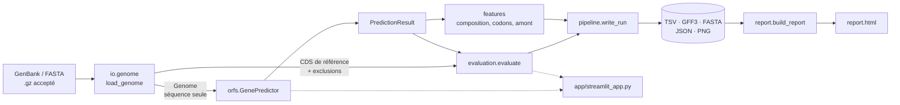
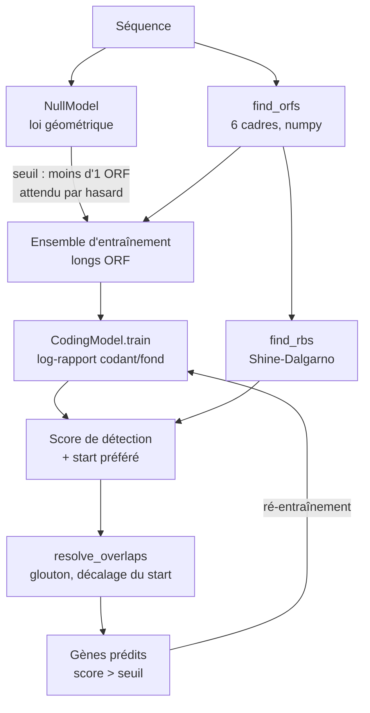

# Architecture

## Principes

1. **Couches séparées.** Le calcul scientifique (`orfs`, `evaluation`, `features`) ne dépend
   ni des figures, ni du rapport, ni de la CLI, ni du dashboard.
2. **Calcul pur, puis écriture.** `pipeline.analyze_genome()` ne touche pas au disque ; les
   écritures sont regroupées dans `write_run()` et `run_project()`. Le dashboard réutilise le
   calcul pur, et la CLI les deux.
3. **Le rapport se reconstruit depuis les fichiers.** `report.build_report()` ne lit que les
   JSON et les PNG écrits par le pipeline. Il est donc régénérable sans recalcul, et ne peut
   afficher que des valeurs réellement calculées.
4. **Le prédicteur ne voit pas l'annotation.** `GenePredictor.predict(genome)` ne reçoit
   qu'un `Genome` : la séparation entre entraînement et évaluation est garantie par
   construction.
5. **Données immuables.** Les résultats sont des `dataclass(frozen=True, slots=True)` et les
   configurations des modèles pydantic figés.

## Flux de données

## Étapes du prédicteur

## Modules

| Module | Responsabilité | Dépend de |
|---|---|---|
| `models` | `Genome`, `Interval`, `ReferenceGene`, `PredictedGene` ; coordonnées circulaires | Biopython |
| `config` | modèles pydantic, chargement YAML, résolution des chemins | pydantic, PyYAML |
| `io.genome` | lecture GenBank/FASTA, validation, extraction de la référence et des exclusions | Biopython `SeqIO` |
| `io.ncbi` | téléchargement E-utilities, gzip déterministe | Biopython `Entrez` |
| `io.writers` | TSV, GFF3, FASTA protéique (`Seq.translate`), JSON | pandas, Biopython |
| `orfs.genetic_code` | encodage des codons, codes génétiques NCBI | `Bio.Data.CodonTable` |
| `orfs.finder` | recherche vectorisée des ORF, circularité | numpy |
| `orfs.null_model` | composition, probabilité de stop, seuil significatif | — |
| `orfs.coding_model` | entraînement et score codon/dicodon | numpy |
| `orfs.rbs` | motif de Shine-Dalgarno | — |
| `orfs.selection` | stratégies de start, sélection gloutonne | numpy |
| `orfs.predictor` | orchestration de l'auto-apprentissage | tout `orfs` |
| `evaluation.matching` | appariement par extrémité 3′ | — |
| `evaluation.metrics` | Wilson, courbes PR, catégories d'écarts, métriques | pandas |
| `features.*` | GC skew (`Bio.SeqUtils`), RSCU, GC3, profil amont (`Bio.motifs`) | Biopython |
| `plotting.*` | figures matplotlib (objets `Figure`, sans `pyplot`), carte Plotly | matplotlib, plotly |
| `report.builder` | rendu Jinja2, images en base64 | Jinja2 |
| `pipeline` | calcul pur, écriture, projet multi-analyses | tout le package |
| `cli` | commandes Typer, messages d'erreur | Typer, Rich |

## Ajouter une fonctionnalité

**Une stratégie de choix du start.** Ajouter la valeur au `Literal` de
`PredictorConfig.start_strategy` et `selection.StartStrategy`, puis une branche dans
`selection.preferred_start()` (qui reçoit les scores codants et les motifs RBS de chaque start).
Le reste du pipeline, l'évaluation, le rapport et le dashboard (liste de choix) s'adaptent
automatiquement. Ajouter un cas dans `tests/unit/test_selection_and_matching.py`.

**Un modèle codant.** Étendre `CodingModel.train()` (nouvelle valeur de `kind`) en conservant
l'interface `start_scores(ids, indices)`. Le prédicteur ne connaît que cette interface.

**Une analyse descriptive.** Créer une fonction pure dans `features/`, la brancher dans
`pipeline.analyze_genome()` (nouveau champ de `RunResult`), ajouter la figure dans `plotting/`,
puis sa légende dans `report.builder.FIGURE_INFO`.

**Un format d'entrée.** `io.genome.detect_format()` et `load_genome()` : tout format lisible par
`Bio.SeqIO` s'ajoute en quelques lignes (EMBL par exemple).

## Choix techniques

| Choix | Raison |
|---|---|
| numpy pour la recherche d'ORF | les tableaux utiles (stops, starts alternatifs, longueurs des régions pour le modèle nul) s'obtiennent par masques et `searchsorted`. Mesuré sur *M. genitalium* : 0,13 s pour les six cadres en mode circulaire avec les starts alternatifs, contre 0,28 s pour une boucle Python simplifiée (linéaire, sans starts alternatifs). Le gain de vitesse est donc modeste ; l'intérêt principal est la simplicité des opérations sur les indices |
| `Figure` matplotlib sans `pyplot` | pas d'état global : sûr dans Streamlit et en exécution parallèle |
| pydantic v2 (`extra="forbid"`) | une faute de frappe dans la configuration est une erreur, pas une option silencieusement ignorée |
| Typer + Rich | CLI typée, aide générée, tableaux lisibles |
| Jinja2 + images base64 | rapport en un seul fichier, partageable par e-mail ou en artefact de CI |
| hatchling + `src/` | empêche d'importer le code non installé par erreur ; build standard PEP 517 |
